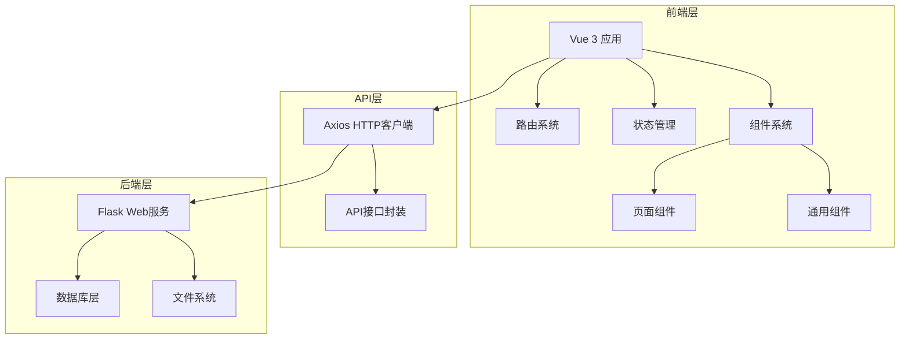
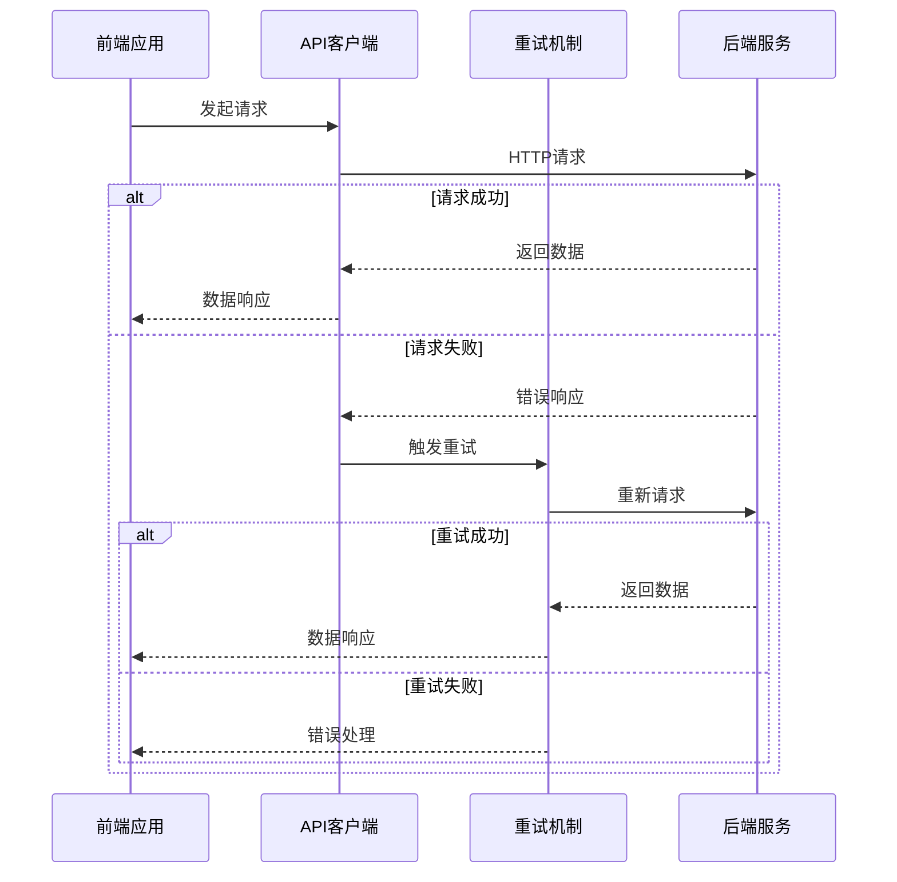
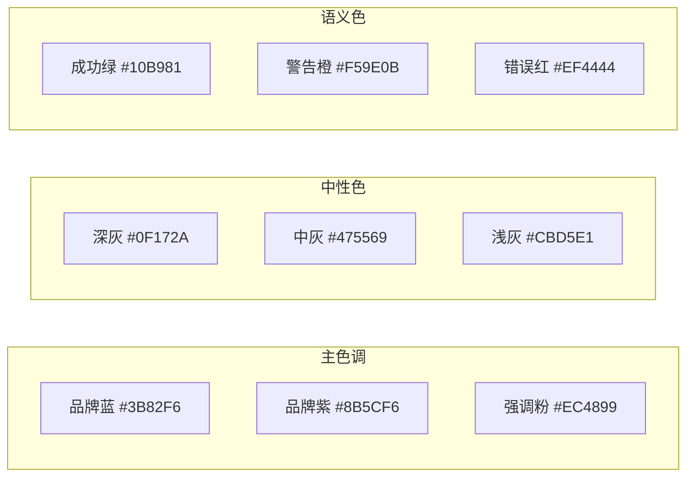
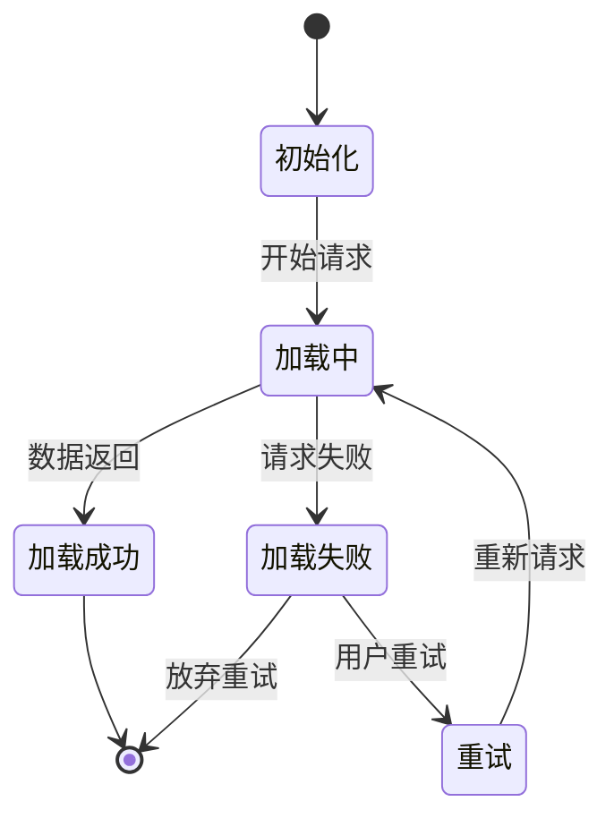
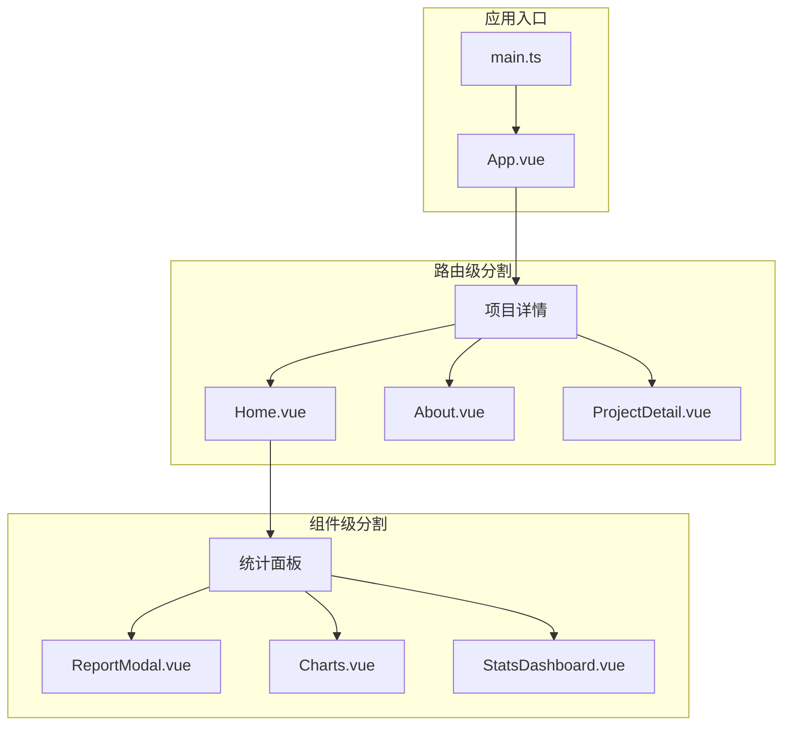
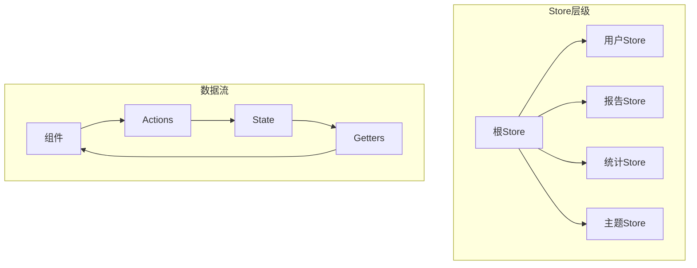
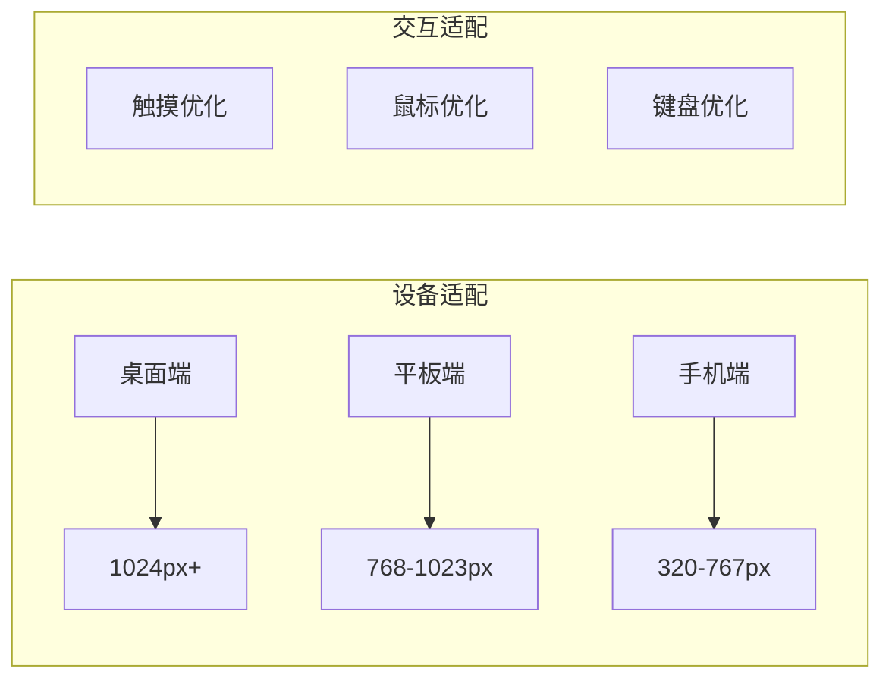
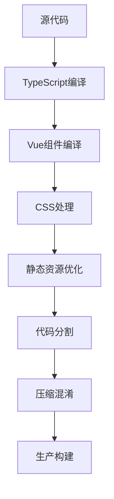

# GitHub热门项目分析器前端优化设计文档

## 概述

本文档针对GitHub热门项目分析器的前端优化需求，从产品经理和独立开发者的角度出发，提供全面的前端重构和用户体验优化方案。项目目标是打造一个专业级的产品界面，提升数据可访问性和视觉体验。

## 技术栈与架构

### 当前技术栈
- **前端**: Vue 3 + Composition API + TypeScript
- **样式**: Tailwind CSS + 自定义CSS
- **构建工具**: Vite
- **状态管理**: Pinia
- **路由**: Vue Router
- **HTTP客户端**: Axios
- **后端**: Flask + Python (端口5001)

### 架构模式
前后端分离架构，通过RESTful API进行数据交互



## 问题分析

### 核心问题识别

1. **API连接问题**
   - 前端配置端口5001，但需要确认后端实际运行端口
   - 缺乏API错误处理和重试机制
   - 无离线状态处理

2. **用户体验问题**
   - 加载状态不够友好
   - 错误提示信息不够详细
   - 缺乏数据为空时的引导
   - 响应式设计有待完善

3. **视觉设计问题**
   - 虽然有现代化设计，但缺乏品牌一致性
   - 颜色搭配可以更加精细化
   - 交互动效需要优化
   - 暗色主题需要更好的对比度

4. **性能问题**
   - 缺乏数据缓存机制
   - 无懒加载实现
   - 大量数据时可能出现性能瓶颈

## 优化方案

### API层优化

#### 连接配置增强


#### API客户端改进
- 实现自动重试机制
- 添加请求/响应拦截器
- 统一错误处理
- 实现请求缓存
- 添加离线检测

### 用户界面优化

#### 设计系统重构

**颜色系统**


**组件层级系统**
- 页面级组件 (Views)
- 布局组件 (Layouts)
- 业务组件 (Business)
- 通用组件 (Common)
- 基础组件 (Base)

#### 核心组件重构

**仪表板组件**
- 实时数据更新
- 可视化图表集成
- 响应式卡片布局
- 交互式统计展示

**报告列表组件**
- 虚拟滚动优化
- 智能搜索过滤
- 批量操作支持
- 实时状态同步

**报告详情组件**
- Markdown渲染优化
- 代码高亮支持
- 导出功能增强
- 分享功能集成

### 交互体验优化

#### 加载状态设计


#### 错误处理策略
- 分级错误提示系统
- 智能错误恢复建议
- 用户友好的错误页面
- 问题反馈收集机制

### 性能优化方案

#### 数据管理优化
- 实现状态持久化
- 智能数据预加载
- 分页数据虚拟化
- 组件级数据缓存

#### 代码分割策略


## 技术实现规范

### 组件开发规范

#### 组件命名约定
- 页面组件: `XxxView.vue`
- 业务组件: `XxxModule.vue`
- 通用组件: `BaseXxx.vue`
- 图标组件: `IconXxx.vue`

#### 代码组织结构
```
src/
├── components/
│   ├── base/           # 基础组件
│   ├── business/       # 业务组件
│   ├── icons/         # 图标组件
│   └── layout/        # 布局组件
├── views/             # 页面组件
├── composables/       # 组合式函数
├── stores/           # 状态管理
├── api/              # API接口
├── utils/            # 工具函数
├── types/            # 类型定义
└── styles/           # 样式文件
```

#### TypeScript类型规范
- 严格的类型定义
- 接口优先于类型别名
- 泛型合理使用
- 类型导入/导出规范

### 样式系统规范

#### CSS类命名约定
- 使用BEM命名法补充Tailwind
- 组件级作用域样式
- 统一的动画时长和缓动函数
- 响应式断点标准化

#### 主题系统设计
- CSS自定义属性支持
- 暗色/亮色主题切换
- 用户偏好记忆
- 无障碍访问支持

### 状态管理规范

#### Pinia Store组织


## 后端配合优化

### API接口优化

#### 数据格式标准化
- 统一响应格式
- 错误码标准化
- 分页参数规范
- 数据字段一致性

#### 性能优化建议
- 实现响应缓存
- 数据库查询优化
- 静态资源CDN
- API限流保护

### 跨域和安全配置
- CORS策略优化
- API版本管理
- 请求验证机制
- 安全头配置

## 用户体验增强

### 可访问性优化

#### WCAG 2.1合规
- 键盘导航支持
- 屏幕阅读器优化
- 色彩对比度改进
- 替代文本完善

#### 多设备适配


### 数据可视化增强

#### 图表集成方案
- Chart.js集成
- D3.js自定义图表
- 实时数据更新
- 交互式数据探索

#### 统计面板重构
- 关键指标突出显示
- 趋势变化可视化
- 对比分析功能
- 数据导出支持

## 部署和维护优化

### 前端构建优化

#### 构建流程改进


#### 部署策略
- 静态资源CDN部署
- 版本控制和回滚
- 环境配置管理
- 监控和日志收集

### 开发体验优化

#### 开发工具配置
- ESLint规则完善
- Prettier代码格式化
- Husky Git钩子
- 自动化测试集成

#### 文档和注释规范
- JSDoc注释标准
- 组件使用文档
- API接口文档
- 开发指南维护

## 实施计划

### 第一阶段：基础优化 (1-2周)
1. API连接问题修复
2. 错误处理机制完善
3. 基础样式系统重构
4. 响应式设计改进

### 第二阶段：功能增强 (2-3周)
1. 数据可视化集成
2. 性能优化实施
3. 用户体验改进
4. 可访问性优化

### 第三阶段：高级特性 (1-2周)
1. 离线功能支持
2. PWA特性集成
3. 高级搜索功能
4. 数据导出增强

### 第四阶段：优化和发布 (1周)
1. 性能测试和优化
2. 跨浏览器兼容性测试
3. 用户体验测试
4. 生产环境部署

## 成功指标

### 技术指标
- **页面加载时间**: < 2秒
- **API响应时间**: < 500ms
- **错误率**: < 1%
- **Core Web Vitals**: 良好评级

### 用户体验指标
- **页面可用性**: WCAG 2.1 AA级
- **移动端适配**: 100%覆盖
- **用户满意度**: > 4.5/5
- **功能完成率**: > 95%

### 业务指标
- **用户留存率**: 提升30%
- **页面停留时间**: 提升50%
- **功能使用率**: 提升40%
- **分享转发率**: 提升25%