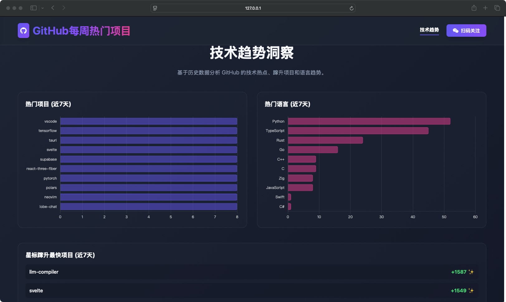
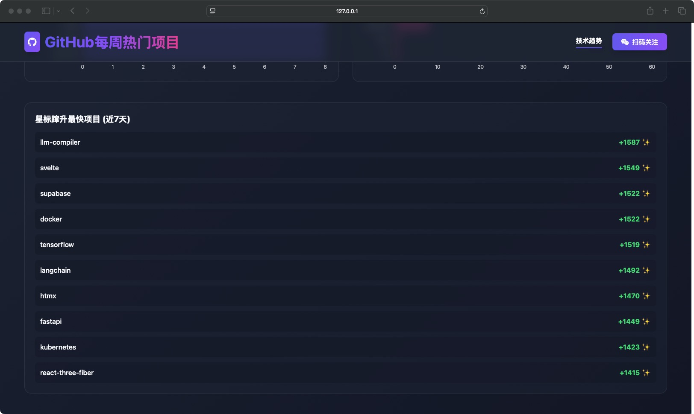

# GitHub Trending Reporter 🚀

English | [简体中文](./README.md)

**An automated bot that analyzes GitHub Trending, curates daily selections, and generates tech insight reports for you.**

[](https://opensource.org/licenses/MIT)

---

## ✨ Features

- **📈 Daily Tracking & Analysis**: Automatically fetches the latest popular projects from GitHub Trending and uses a Large Language Model (LLM) for in-depth analysis, producing insights like "one-sentence reviews," "technical highlights," and "potential impact."
- **🌐 Interactive Web UI**: Provides a beautiful, modern web interface for browsing, searching, and filtering reports, offering a much richer experience than static Markdown.
- **🚀 Smart Dashboard**: Features a built-in trend analysis dashboard to view the "most frequent projects," "popular language trends," and "fastest-growing projects," helping you stay ahead of technology trends.
- **⚙️ Highly Configurable**: Almost all core parameters—from the LLM model and API endpoint to the fetch frequency and report count—can be easily configured via environment variables.
- **📦 Out-of-the-Box**: Comes with Docker support for a one-command startup, eliminating complex environment setup.

## 📊 Dashboard and Report Examples

The project not only generates detailed daily reports but also provides a multi-dimensional data analysis dashboard.

| Feature | Screenshot |
| :--- | :--- |
| **Web Report Homepage** |  |
| **Interactive Project Cards** |  |
| **Star Surge Trend Analysis** |  |
| **Markdown Output Example** |  |


## 🛠️ Tech Stack

- **Backend**: Python 3.x, Flask
- **Data Scraping**: `requests`, `BeautifulSoup4`
- **AI Integration**: `openai`
- **Task Scheduling**: `schedule`
- **Database**: `SQLite`
- **Deployment**: `Docker`, `Docker Compose`

## 🚀 Quick Start

### 1. Prerequisites

-   Git
-   Docker and Docker Compose

### 2. Clone and Configure

Clone the repository and navigate into the project directory:
```bash
git clone https://github.com/lgy1027/ai-git-trending.git
cd ai-git-trending
```

Next, configure your environment variables. The project uses a `.env` file in the root directory, which is loaded by Docker Compose.
```bash
# Note: We have already created the .env file in previous steps.
# If you are starting fresh, please copy the example file:
# cp .env.example .env
```
Now, edit the `.env` file with your credentials:
```env
# .env
LLM_API_KEY="sk-your_api_key_here"
LLM_BASE_URL="https://api.openai.com/v1" # Adjust for your service provider
LLM_MODEL="gpt-4-turbo" # Optional, defaults to gpt-4-turbo
GITHUB_API_TOKEN="" # Recommended for more detailed data
```

### 3. Run the Application

#### Option 1: Using Docker Compose (Recommended)

With Docker and Docker Compose installed, run the following command from the project root:
```bash
docker-compose up --build
```
Once the services are up, you can access the web interface at `http://localhost:8080`.

#### Option 2: Local Development

For local development, please refer to the instructions in `backend/README.md` and `frontend/README.md`.

## v1.1 Update Notes (2025-09-22)

This update addresses the issue where the project could not be started with Docker and optimizes the project structure for easier deployment and use.

-   **Introduced Docker Compose**: A `docker-compose.yml` file has been added to orchestrate the frontend and backend services, enabling a true one-command startup.
-   **Fixed Docker Build Failure**: Resolved the build error caused by a missing `Dockerfile`.
-   **Decoupled Frontend/Backend Deployment**: Created separate `Dockerfile`s for the frontend and backend. Nginx is now used as the web server for the frontend, configured with a reverse proxy for API calls.
-   **Fixed Database Path Issue**: Corrected an issue where the database could not be created or accessed inside a Docker container due to an incorrect path calculation.
-   **Fixed LLM Call Errors**: Resolved API call failures caused by an incompatible `temperature` parameter with certain new models.
-   **Unified Environment Management**: Consolidated all necessary environment variables into a single `.env` file in the root directory for easy management with Docker Compose.

## ⚙️ Detailed Configuration

All primary configurations are managed through the root `.env` file.

- `LLM_API_KEY`: **(Required)** Your Large Language Model service API Key.
- `LLM_BASE_URL`: **(Required)** The base URL for your Large Language Model service.
- `LLM_MODEL`: (Optional) The model to use, defaults to `gpt-4-turbo`.
- `GITHUB_API_TOKEN`: (Optional) Your GitHub API Token. Providing this allows for more detailed project information and helps avoid API rate limiting issues.
- `SCHEDULE_TIME`: (Optional) The time for the daily task to run, in "HH:MM" format. Defaults to `"09:00"`.
- `NUM_PROJECTS_TO_SUMMARIZE`: (Optional) The number of new projects to analyze each day. Defaults to `8`.
- `MAX_PROJECTS_TO_SCRAPE`: (Optional) The number of projects to filter from the Trending list. Defaults to `25`.
- `TRENDING_DATE_RANGE`: (Optional) The time range to scrape. Options are `daily`, `weekly`, `monthly`. Defaults to `daily`.

## WeChat

Welcome to follow us for real-time technical analysis and cutting-edge news.


## 🤝 Contributing

Contributions of any kind are welcome! If you have a great idea or find a bug, feel free to open an Issue or submit a Pull Request.

## 📄 License

This project is licensed under the MIT License.