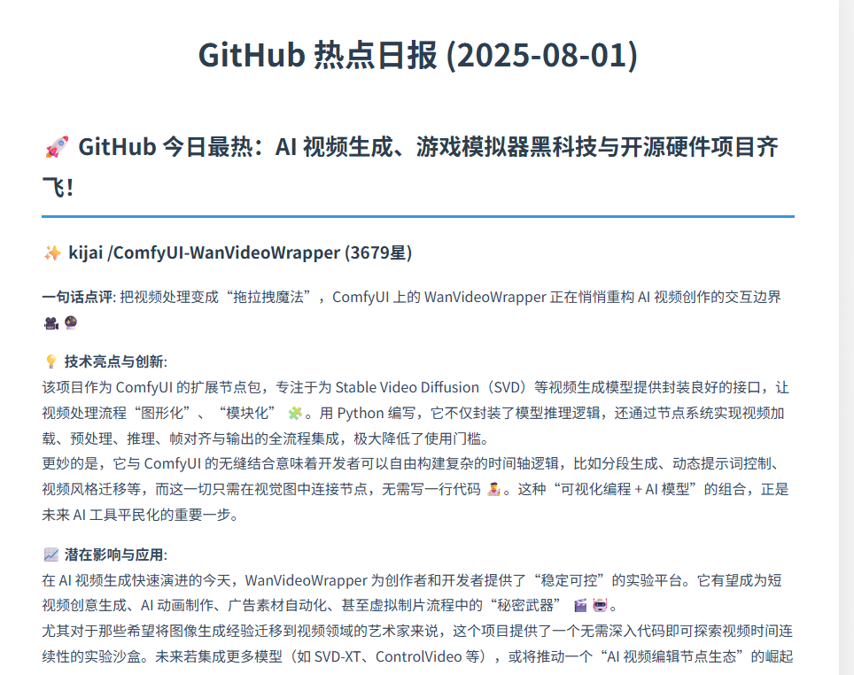

# GitHub Trending Reporter 🚀

English | [简体中文](./README.md)

**An automated bot that analyzes GitHub Trending, curates daily selections, and generates tech insight reports for you.**

[](https://opensource.org/licenses/MIT)

---

## ✨ Features

- **📈 Daily Tracking**: Fetches the latest popular projects from GitHub Trending at a scheduled time (9 AM daily by default).
- **🤖 Smart Filtering**: Automatically filters out projects that have already been analyzed, ensuring you get fresh technical perspectives every day.
- **🧠 AI-Powered In-depth Analysis**: Uses a Large Language Model (LLM) to analyze each new project, producing deep insights including a "one-sentence review," "technical highlights," and "potential impact."
- **🌐 Interactive Web UI**: Browse, search, and view reports through a beautiful web interface.
- **📰 Multi-Format Reports**: Automatically generates beautiful Markdown reports, dynamically rendered on the web page.
- **⚙️ Highly Configurable**: Almost all core parameters (like the number of daily analyses, scrape targets, LLM model, prompt templates, etc.) can be easily customized in the `.env` file.
- **💾 Local Persistence**: Uses an SQLite database to keep track of analyzed projects, avoiding repetitive work.

## 📝 Output Example

The project generates daily reports in the `output` directory.

### Markdown Report (`.md`)

A clean, structured Markdown file suitable for direct publishing on various platforms.

```markdown
## 🚀 The AI wave continues to sweep, and today GitHub is buzzing with several game-changing open-source models!

### ✨ awesome-project

**One-Sentence Review**: A revolutionary tool that solves a major pain point in the X domain.
**💡 Tech Highlights & Innovations**: It utilizes the latest A technology and B framework, with a particularly clever C design pattern.
**📈 Potential Impact & Applications**: Poised to set a new standard in the Y industry, especially suitable for X, Y, and Z scenarios.
**🔗 Project Link**: [awesome-project](https://github.com/user/awesome-project)

---

### ✨ another-cool-repo

**One-Sentence Review**: ...
...
```
 

### Interactive Web UI

An HTML file with a modern, card-based design for a better visual reading experience.


## 🛠️ Tech Stack

- **Python 3.x**
- **Web Framework**: `Flask`
- **Core Libraries**:
  - `requests` & `BeautifulSoup4`: For web scraping.
  - `openai`: For interacting with the Large Language Model API.
  - `schedule`: For task scheduling.
  - `python-dotenv`: For environment variable management.
  - `markdown`: For converting Markdown text to HTML.
- **Database**: `SQLite`

## 🚀 Installation and Setup

1.  **Clone the repository**
    ```bash
    git clone https://github.com/lgy1027/ai-trending.git
    cd ai-trending
    ```

2.  **Install dependencies**
    It's recommended to install in a virtual environment:
    ```bash
    pip install -r requirements.txt
    ```

3.  **Configure environment variables**
    The project uses a `.env` file to manage sensitive information. Copy `.env.example` to `.env`:
    ```bash
    cp .env.example .env
    ```
    Then, edit the `.env` file to add your `LLM_API_KEY` and `LLM_BASE_URL`.
    ```env
    # .env
    LLM_API_KEY="sk-your_api_key_here"
    LLM_BASE_URL="https://api.openai.com/v1" # Change to your service's URL if using another provider
    LLM_MODEL="gpt-4-turbo" # Optional, defaults to gpt-4-turbo
    ```

## 🏃‍♂️ How to Run

The project has two main entry points:

### 1. Run the Report Generator

Run `run_reporter.py` to scrape and analyze projects, generating daily reports.

```bash
python run_reporter.py
```

### 2. Start the Web Service

Run `run_web.py` to start the local web server and access the interactive interface through your browser.

```bash
python run_web.py
```

Once the service is running, you can access it by default at `http://127.0.0.1:5000`.

## 🐳 Running with Docker

You can also use Docker to build and run this project, avoiding the need to configure a local Python environment.

1.  **Build the Docker image**
    In the project root directory, run the following command:
    ```bash
    docker build -t trending-reporter .
    ```

2.  **Run the Docker container**
    Use the `--env-file` flag to load your environment variables from the `.env` file:
    ```bash
    docker run --env-file .env trending-reporter
    ```
    Once the container starts, the program will run just like it does locally: it will execute one task immediately and then enter scheduled mode.

## ⚙️ Configuration

### Via `.env` file
The project uses a `.env` file to manage sensitive information. Please copy `.env.example` to `.env`:

- `LLM_API_KEY`: **(Required)** Your Large Language Model service API Key.
- `LLM_BASE_URL`: **(Required)** The base URL for your Large Language Model service.
- `LLM_MODEL`: (Optional) The model to use, defaults to `gpt-4-turbo`.
- `SCHEDULE_TIME`: (Optional) The time for the daily task to run, in "HH:MM" format. Defaults to `"09:00"`.
- `NUM_PROJECTS_TO_SUMMARIZE`: (Optional) The number of new projects to analyze each day. Defaults to `8`.
- `MAX_PROJECTS_TO_SCRAPE`: (Optional) The range of projects to filter from the Trending list. Defaults to `25`.
- `TRENDING_DATE_RANGE`: (Optional) The time range to scrape. Options are `daily`, `weekly`, `monthly`. Defaults to `daily`.

### Via `config/settings.py` file

The following settings are relatively static, but you can modify them in `config/settings.py` if needed:

- `GITHUB_TRENDING_URL`: The URL for GitHub Trending.
- `SINGLE_PROJECT_PROMPT_TEMPLATE`: The prompt template for analyzing a single project.
- `OVERVIEW_PROMPT_TEMPLATE`: The prompt template for generating the report's introduction.

## 🤝 Contributing

Contributions of any kind are welcome! If you have a great idea or find a bug, feel free to open an Issue or submit a Pull Request.

1.  Fork the Project
2.  Create your Feature Branch (`git checkout -b feature/AmazingFeature`)
3.  Commit your Changes (`git commit -m 'Add some AmazingFeature'`)
4.  Push to the Branch (`git push origin feature/AmazingFeature`)
5.  Open a Pull Request

## WeChat

Welcome to follow us for real-time technical analysis and cutting-edge news.


## 📄 License

This project is licensed under the MIT License.
