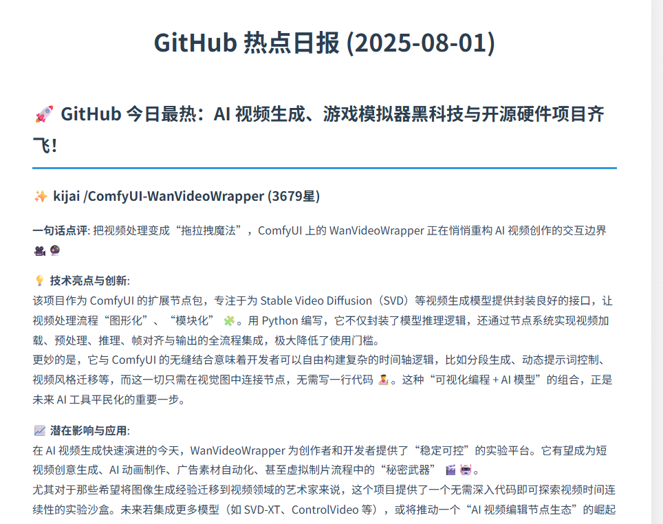
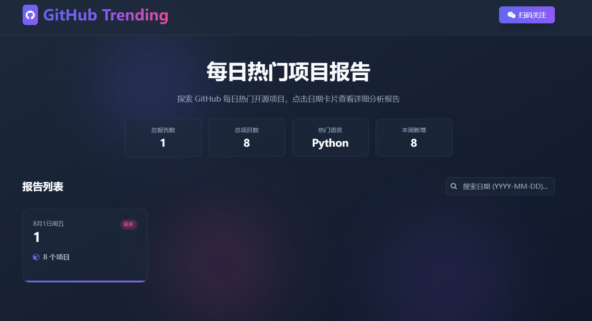

# GitHub Trending Reporter 🚀

[English](./README-EN.md) | 简体中文

**一个自动化分析 GitHub Trending 的机器人，为您每日精选、总结并生成技术洞察报告。**

[](https://opensource.org/licenses/MIT)

---

## ✨ 功能特性

- **📈 每日追踪**：定时（默认每日上午9点）抓取 GitHub Trending 上的最新热门项目。
- **🤖 智能筛选**：自动过滤已经分析过的项目，确保每天为您带来全新的技术视野。
- **🧠 AI 深度分析**：利用大语言模型（LLM）对新项目进行逐一分析，产出包含“一句话点评”、“技术亮点”和“潜在影响”的深度洞察。
- **🌐 交互式 Web 界面**：通过美观的 Web 界面浏览、搜索和查看报告。
- **📰 多格式报告**：自动生成精美的 Markdown 报告，并可在网页上动态渲染。
- **⚙️ 高度可配置**：几乎所有核心参数（如每日分析数量、抓取目标、LLM 模型、Prompt 模板等）都可以在 `.env` 文件中轻松定制。
- **💾 本地持久化**：使用 SQLite 数据库记录已分析过的项目，避免重复工作。

## 📝 产出示例

项目会每日在 `output` 目录下生成报告。

### Markdown 报告 (`.md`)

一份清晰、结构化的 Markdown 文件，适合在各种平台直接发布。

```markdown
## 🚀 AI 浪潮持续席卷，今天 GitHub 被几个颠覆性的开源模型刷屏了！

### ✨ awesome-project

**一句话点评**: 一个解决了某某领域痛点的革命性工具。
**💡 技术亮点与创新**: 采用了最新的 A 技术和 B 框架，其 C 设计模式非常巧妙。
**📈 潜在影响与应用**: 有望在某某行业掀起新的标准，尤其适合于 X、Y、Z 场景。
**🔗 项目链接**: [awesome-project](https://github.com/user/awesome-project)

---

### ✨ another-cool-repo

**一句话点评**: ...
...
```
 


### 交互式 Web 界面

一份拥有现代化卡片式设计的 Web 界面，提供更佳的视觉阅读体验。



## 🛠️ 技术栈

- **Python 3.x**
- **Web 框架**: `Flask`
- **核心库**:
  - `requests` & `BeautifulSoup4`: 用于网页抓取。
  - `openai`: 用于与大语言模型 API 交互。
  - `schedule`: 用于任务定时调度。
  - `python-dotenv`: 用于环境变量管理。
  - `markdown`: 用于将 Markdown 文本转换为 HTML。
- **数据库**: `SQLite`

## 🚀 安装与配置

1.  **克隆仓库**
    ```bash
    git clone https://github.com/lgy1027/ai-trending.git
    cd ai-trending
    ```

2.  **安装依赖**
    建议在虚拟环境中进行安装：
    ```bash
    pip install -r requirements.txt
    ```

3.  **配置环境变量**
    项目通过 `.env` 文件管理敏感信息。请将 `.env.example` 复制为 `.env`：
    ```bash
    cp .env.example .env
    ```
    然后，编辑 `.env` 文件，填入您的 `LLM_API_KEY` 和 `LLM_BASE_URL`。
    ```env
    # .env
    LLM_API_KEY="sk-your_api_key_here"
    LLM_BASE_URL="https://api.openai.com/v1" # 如果使用其他服务，请修改为对应的 URL
    LLM_MODEL="gpt-4-turbo" # 可选，默认为 gpt-4-turbo
    ```

## 🏃‍♂️ 如何运行

项目包含两个主要入口：

### 1. 运行报告生成器

运行 `run_reporter.py` 来抓取和分析项目，并生成每日报告。

```bash
python run_reporter.py
```

### 2. 启动 Web 服务

运行 `run_web.py` 来启动本地 Web 服务器，通过浏览器访问交互式界面。

```bash
python run_web.py
```

服务启动后，默认可以在 `http://127.0.0.1:5000` 访问。

## 🐳 使用 Docker 运行

您也可以使用 Docker 来构建和运行本项目，从而避免在本地配置 Python 环境。

1.  **构建 Docker 镜像**
    在项目根目录下执行以下命令：
    ```bash
    docker build -t trending-reporter .
    ```

2.  **运行 Docker 容器**
    使用 `--env-file` 标志来加载您的 `.env` 文件中的环境变量：
    ```bash
    docker run --env-file .env trending-reporter
    ```
    容器启动后，程序将和直接运行时一样，立即执行一次任务，然后进入定时调度模式。

## ⚙️ 项目配置项

### 通过 `.env` 文件配置
项目通过 `.env` 文件管理敏感信息。请将 `.env.example` 复制为 `.env`：

- `LLM_API_KEY`: **（必需）** 您的大语言模型服务 API Key。
- `LLM_BASE_URL`: **（必需）** 您的大语言模型服务的基础 URL。
- `LLM_MODEL`: （可选）指定使用的模型，默认为 `gpt-4-turbo`。
- `SCHEDULE_TIME`: （可选）每日任务执行的时间，格式为 "HH:MM"，默认为 `"09:00"`。
- `NUM_PROJECTS_TO_SUMMARIZE`: （可选）每日分析的新项目数量，默认为 `8`。
- `MAX_PROJECTS_TO_SCRAPE`: （可选）从 Trending 列表中筛选的项目范围，默认为 `25`。
- `TRENDING_DATE_RANGE`: （可选）指定抓取的时间范围，可选值为 `daily`, `weekly`, `monthly`，默认为 `daily`。

### 通过 `config/settings.py` 文件配置

以下配置项相对固定，但如有需要，也可以在 `config/settings.py` 中进行修改：

- `GITHUB_TRENDING_URL`: GitHub Trending 的 URL 地址。
- `SINGLE_PROJECT_PROMPT_TEMPLATE`: 用于生成单个项目分析的 Prompt 模板。
- `OVERVIEW_PROMPT_TEMPLATE`: 用于生成报告开篇导语的 Prompt 模板。

## 公众号

欢迎关注，获取实时技术解析及前沿新闻


## 🤝 贡献指南

欢迎任何形式的贡献！如果您有好的想法或发现了 Bug，请随时提出 Issue 或提交 Pull Request。

1.  Fork 本仓库
2.  创建您的特性分支 (`git checkout -b feature/AmazingFeature`)
3.  提交您的更改 (`git commit -m 'Add some AmazingFeature'`)
4.  推送到分支 (`git push origin feature/AmazingFeature`)
5.  打开一个 Pull Request

## 📄 许可证

本项目采用 [MIT 许可证](LICENSE)。
